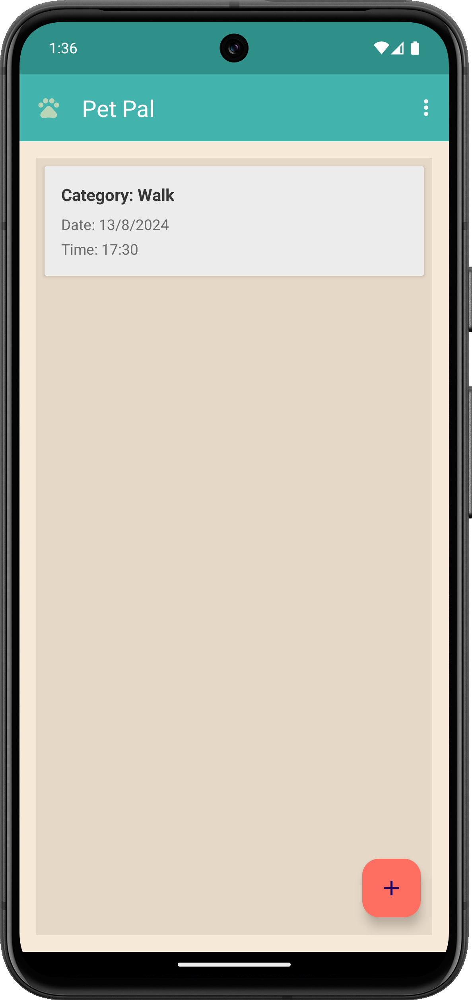
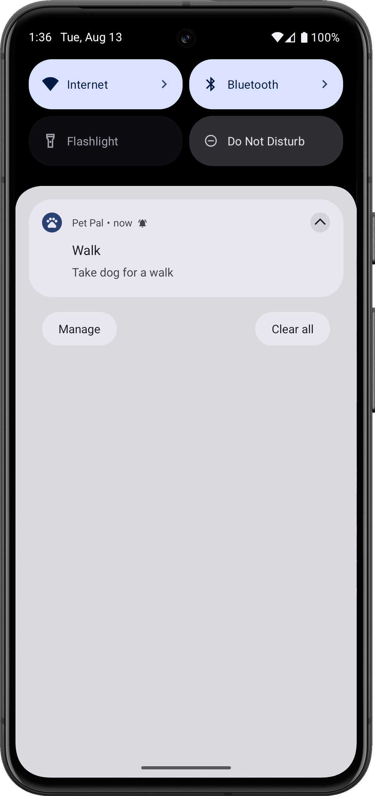
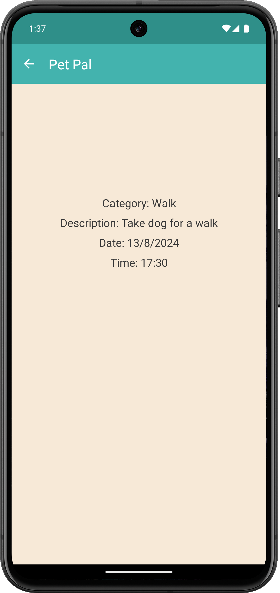

# Pet Pal

**Pet Pal** is a mobile application designed to help pet owners manage and keep track of their pet's medication schedules and other important reminders. With Pet Pal, users can create reminders for their pets' medication, vaccinations, grooming, and more. The app provides a user-friendly interface with features such as customizable notifications, date and time selection, and an intuitive UI.

## Table of Contents

- [Features](#features)
- [Screenshots](#screenshots)

## Features

- **Custom Reminders:** Set reminders for various pet-related tasks such as medication, grooming, or vet visits.
- **Custom Notification Sounds:** Users can set custom notification sounds for reminders.
- **Intuitive User Interface:** Easy-to-use interface with date and time pickers, dropdown menus, and more.
- **Notification Support:** Receive notifications with details about your reminder.
- **Back Navigation:** Seamless navigation between screens using the back button on the toolbar.

## Screenshots

*Screenshot of the home screen showing upcoming reminders.*

*Screenshot of the notification reminder.*

*Screenshot of the reminder details.*   
